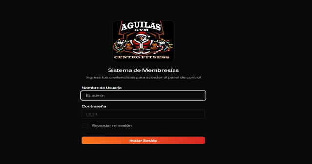

# Sistema Web para Gestión de Membresías y Pagos

## Descripción

Sistema web desarrollado para administrar clientes, membresías y pagos del Gimnasio Águilas de la ciudad de Camiri.

El proyecto fue realizado como parte de la carrera de Ingeniería de Sistemas.

---

## Objetivo

Digitalizar los procesos administrativos del gimnasio mediante una aplicación web que permita registrar clientes, controlar membresías, gestionar pagos y generar reportes.

---

## Tecnologías utilizadas

### Backend

- PHP
- Laravel 12

### Frontend

- Vue.js
- Inertia.js
- Tailwind CSS

### Base de Datos

- PostgreSQL

### Herramientas

- Visual Studio Code
- Git
- GitHub

---

## Funcionalidades

- Inicio de sesión
- Gestión de usuarios
- Gestión de clientes
- Gestión de membresías
- Registro de pagos
- Reportes
- Dashboard
- Control de acceso por roles

---

## Arquitectura

Modelo Vista Controlador (MVC)

---

## Capturas del Sistema

### Inicio de sesión

### Dashboard

### Gestión de Clientes

### Gestión de Membresías y Pagos

### Gestión de Reportes

---

## Autor

**Carlos Daniel Ugarte Avalos**

Estudiante de Ingeniería de Sistemas

Universidad Autónoma Gabriel René Moreno (UAGRM)
